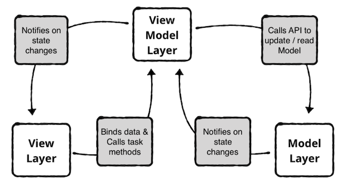
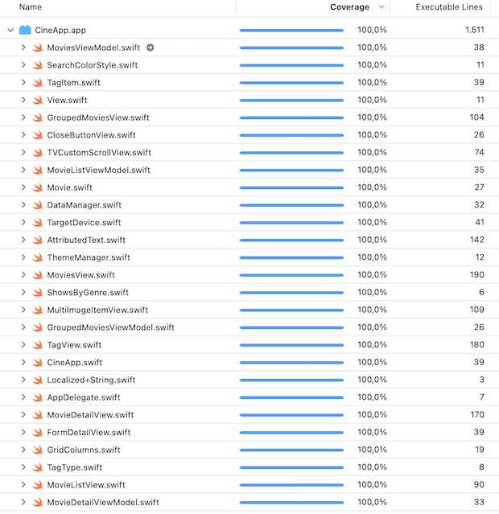

# Cine app example

This demo app support iPhone and iPad layouts and implements the next screens:
 
- <b>Movie list with search and tags:</b>

The first screen consists of a list of movies. The header of the view has a list of tags to search grouped movies by country. The list shows movie images in a Grid. All Grid images are implemented with an automatic resize. The Grid was implemented as lazy memory and images caches don't use device memory.

You can search a movie too by title of the movie or director (or one of directors) of the movie. 

• [MovieListView](https://github.com/carlosmobile/Cine/blob/main/CineApp/CineApp/Scenes/MovieListView.swift): Movie list principal view. It load tags and child tag view. 
• [MovieListViewModel](https://github.com/carlosmobile/Cine/blob/main/CineApp/CineApp/Scenes/MovieListViewModel.swift): Movie list viewModel. 

Tags: 
• [TagType](https://github.com/carlosmobile/Cine/blob/main/CineApp/CineApp/Scenes/Tags/TagType.swift): To get selected tag view.  
Tags Views: 
• [MoviesView](https://github.com/carlosmobile/Cine/blob/main/CineApp/CineApp/Scenes/TagsViews/MoviesView.swift): To load a tag view A-Z with animated search textfield. 
• [MoviesViewModel](https://github.com/carlosmobile/Cine/blob/main/CineApp/CineApp/Scenes/TagsViews/MoviesViewModel.swift): The view model to movies tag view. 
• [GroupedMoviesView](https://github.com/carlosmobile/Cine/blob/main/CineApp/CineApp/Scenes/TagsViews/GroupedMoviesView.swift): To show each country tag. This view show movies grouped by tag region countries 
• [GroupedMoviesViewModel](https://github.com/carlosmobile/Cine/blob/main/CineApp/CineApp/Scenes/TagsViews/GroupedMoviesViewModel.swift): The viewModel to grouped movies tag view.
 

Once you click on a movie poster of the list you will be redirected to another screen with more specific information about the movie.
 
- <b>Movie detail:</b>

The second screen will display more detailed information about a movie. Showing the title, year, lenght in minutes, country or countries are from, score, director or directors, writers, actors and synopsis. The synopsis has a vertical scroll.

• [MovieDetailView](https://github.com/carlosmobile/Cine/blob/main/CineApp/CineApp/Scenes/MovieDetailView.swift): To show movie detail view. Its present like a modal view with shadows. 
• [MovieDetailViewModel](https://github.com/carlosmobile/Cine/blob/main/CineApp/CineApp/Scenes/MovieDetailViewModel.swift): The viewModel to movie detail view. 
  
  
Example gifs with iPhone 14 Xcode simulator:

        

        

     
  
Example gif with iPad Pro (11 inch) Xcode simulator:
 
  
 
   

# Architecture

I use native <b>SwiftUI MVVM</b>, of course this is a flexible architecture and I can implement it in a basic or advanced way as needed.
This project supports UIKit and SwiftUI views. In case that we need to solve some issue with SwiftUI we can solve it using ViewModel fully compatible with both UIKit and SwiftUI views.  
MVVM is a "reactive" architecture. Its a perfect fit to use SwiftUI with Combine. The view reacts to changes on the view model, and the view model updates its state based on data from the model.

  

MVVM involves three layers:

- The <b>model layer</b> contains data access objects and validation logic. It knows how to read and write data, and it notifies the view model when data changes.  
- The <b>view model layer</b> contains the state of the view and has methods to handle user interaction. It calls methods on the model layer to read and write data, and it notifies the view when the model’s data changes.  
- The <b>view layer</b> styles and displays on-screen elements. It doesn’t contain business or validation logic. Instead, it binds its visual elements to properties on the view model. It also receives user inputs and interaction, and it calls methods on the view model in response.  
As a result, the view layer and model layer are completely decoupled. The view layer and model layer only communicate with the view model layer but we can binding model to view with Combine if we need to use reactive programming way.

This architecture has been used because it's considered an advance architecture that modulates the code and respect the clean code, SOLID principles and the best practices.

   

# Tools

- [AttributedText](https://github.com/carlosmobile/Cine/blob/main/CineApp/CineApp/Tools/AttributedText.swift): Helper to format html strings. 
- [GridColumns](https://github.com/carlosmobile/Cine/blob/main/CineApp/CineApp/Tools/GridColumns.swift): Helper to show grid columns perfect fit size to iPad and iPhone screens. 
- [TargetDevice](https://github.com/carlosmobile/Cine/blob/main/CineApp/CineApp/Tools/TargetDevice.swift): To get current target device to show GridColumns. 
- [TVCustomScrollView](https://github.com/carlosmobile/Cine/blob/main/CineApp/CineApp/Tools/TVCustomScrollView.swift): Custom SwiftUI scroll to get scrollOffset, scrollTotalHeight and other info to improve scroll animations, in this case to improve search textfield show/hide. 
  

# Common

- [SearchColorStyle](https://github.com/carlosmobile/Cine/blob/main/CineApp/CineApp/Common/SearchColorStyle.swift): Custom reusable SwiftUI color styles to change color states, in this case to search textfield. 
- [TagView](https://github.com/carlosmobile/Cine/blob/main/CineApp/CineApp/Common/TagView.swift): Custom reusable SwiftUI view with alignment guides to show search tags. 
- [MultiImageItemView](https://github.com/carlosmobile/Cine/blob/main/CineApp/CineApp/Common/MultiImageItemView.swift): Custom reusable SwiftUI View to show images in LazyGrid. 
- [CloseButtonView](https://github.com/carlosmobile/Cine/blob/main/CineApp/CineApp/Common/CloseButtonView.swift): Custom reusable SwiftUI View to show close button, in this case to show movie detail close button. 
- [FormDetailView](https://github.com/carlosmobile/Cine/blob/main/CineApp/CineApp/Common/FormDetailView.swift): Custom reusable SwiftUI View to show detail movie data in a better readability way. 
  

# Extension class

- [View](https://github.com/carlosmobile/Cine/blob/main/CineApp/CineApp/Extension/View.swift): To add custom placeholder view to SwiftUI. 
- [UIScreen](https://github.com/carlosmobile/Cine/blob/main/CineApp/CineApp/Extension/UIScreen.swift): Extension to get different screen sizes from UIScreen. 
- [Localized+String](https://github.com/carlosmobile/Cine/blob/main/CineApp/CineApp/Extension/Localized%2BString.swift): To improve the LocalizedString sintax. 
  

# Models

Structs:

- [Movie](https://github.com/carlosmobile/Cine/blob/main/CineApp/CineApp/Models/Movie.swift): To model Movie data. 
- [ShowsByGenre](https://github.com/carlosmobile/Cine/blob/main/CineApp/CineApp/Models/ShowsByGenre.swift): To model Movie collections by genre. 
- [TagItem](https://github.com/carlosmobile/Cine/blob/main/CineApp/CineApp/Models/TagItem.swift): To model tags to search. 
  

# Networking

- [DataManager](https://github.com/carlosmobile/Cine/blob/main/CineApp/CineApp/Network/DataManager.swift): Manager to get and parse data from json to models. 
- [last7d.cine](https://github.com/carlosmobile/Cine/blob/main/CineApp/CineApp/Network/last7d.cine.json): json origin movie data. 

  
# XCTests

This app test ViewModels, Models, Tools, Common, etc.. with [XCTests](https://github.com/carlosmobile/Cine/tree/main/CineApp/CineAppTests) and [UITests](https://github.com/carlosmobile/Cine/tree/main/CineApp/CineAppUITests). 
Test Coverage 100%

  

  
# Swift Guide Style

The app code follows the [Ray Wenderlich Swift Style Guide](https://github.com/raywenderlich/swift-style-guide). 
  
# Centralized data

The app uses in "support" logical folder a [ThemeManager.swift](https://github.com/carlosmobile/Cine/blob/main/CineApp/CineApp/Support/ThemeManager.swift) class to support centralized colors. It also uses multilanguage with Localizable.strings to centralized all the text in the app.
  
# Swift Package Manager

- [Kingfisher](https://github.com/onevcat/Kingfisher): Used to implement an easy way to download images from server with animation spinner and fade. 
  
# GitFlow

This app is developed using [GifFlow](https://www.atlassian.com/git/tutorials/comparing-workflows/gitflow-workflow), using only git commands and tool sourcetree.
  
# Design

The app try to implement nice design and UI/UX, respecting the iOS native elements as Apple guidelines and have a correct layout and implement the safe areas to correct view in last iPhone models.

  

# Getting Started

Running in Xcode 14.2 and iOS 16.3 Written in Swift 5
  

# Next..

Add network layer with real API service, add favourites, persistence of data, etc..
  

