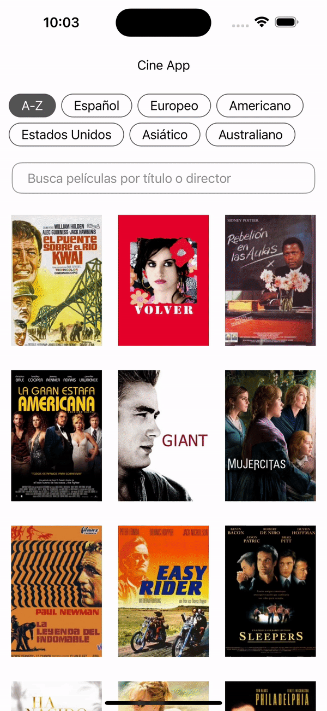
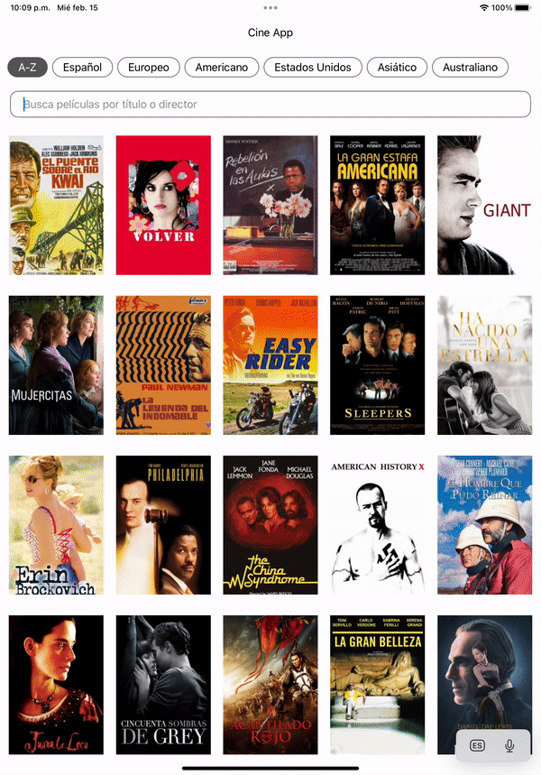

# Cine app example

This demo app supports iPhone and iPad layouts and implements the following screens:
 
- <b>Movie list with search and tags:</b>

The first screen displays a list of movies. The view's header includes a list of tags for searching movies grouped by country. The list presents movie images in a grid, with all grid images featuring automatic resizing. The grid is implemented to be memory-efficient, and image caching does not utilize device memory.

Users can also search for a movie by the movie's title or by the director (or one of the directors).

• [MovieListView](https://github.com/carlosmobile/Cine/blob/main/CineApp/CineApp/Scenes/MovieListView.swift): The main movie list view. It loads tags and child tag views. 
• [MovieListViewModel](https://github.com/carlosmobile/Cine/blob/main/CineApp/CineApp/Scenes/MovieListViewModel.swift): The view model for the movie list. 

Tags: 
• [TagType](https://github.com/carlosmobile/Cine/blob/main/CineApp/CineApp/Scenes/Tags/TagType.swift): To get selected tag view.  
Tags Views: 
• [MoviesView](https://github.com/carlosmobile/Cine/blob/main/CineApp/CineApp/Scenes/TagsViews/MoviesView.swift): Loads an A-Z tag view with an animated search text field. 
• [MoviesViewModel](https://github.com/carlosmobile/Cine/blob/main/CineApp/CineApp/Scenes/TagsViews/MoviesViewModel.swift): The view model for the movies tag view. 
• [GroupedMoviesView](https://github.com/carlosmobile/Cine/blob/main/CineApp/CineApp/Scenes/TagsViews/GroupedMoviesView.swift): Displays movies grouped by country tag. This view shows movies grouped by tag region countries. 
• [GroupedMoviesViewModel](https://github.com/carlosmobile/Cine/blob/main/CineApp/CineApp/Scenes/TagsViews/GroupedMoviesViewModel.swift): The view model for the grouped movies tag view.
 

Clicking on a movie poster in the list redirects you to another screen with more specific information about the movie.
 
- <b>Movie detail:</b>

The second screen provides detailed information about a movie, including the title, year, length in minutes, countries of origin, score, directors, writers, actors, and synopsis. The synopsis is scrollable vertically.

• [MovieDetailView](https://github.com/carlosmobile/Cine/blob/main/CineApp/CineApp/Scenes/MovieDetailView.swift): Displays the movie detail view. It is presented as a modal view with shadows. 
• [MovieDetailViewModel](https://github.com/carlosmobile/Cine/blob/main/CineApp/CineApp/Scenes/MovieDetailViewModel.swift): The view model for the movie detail view. 
  
  
Example gifs with iPhone 14 Xcode simulator:

     

     

  
Example gif with iPad Pro (11 inch) Xcode simulator:
 
      
 
   

# Architecture

I use native <b>SwiftUI MVVM</b>, which is a flexible architecture that can be implemented in a basic or advanced manner as needed. This project supports both UIKit and SwiftUI views. In case of issues with SwiftUI, we can address them using the ViewModel, which is fully compatible with both UIKit and SwiftUI views.  
MVVM is a "reactive" architecture, ideally suited for use with SwiftUI and Combine. The view reacts to changes in the view model, and the view model updates its state based on data from the model.

  

MVVM involves three layers:

- The <b>model layer</b> contains data access objects and validation logic. It is responsible for reading and writing data, and it notifies the view model when data changes.  
- The <b>view model layer</b> contains the state of the view and has methods to handle user interaction. It calls methods on the model layer for data access and updates the view when the model's data changes.  
- The <b>view layer</b> is responsible for styling and displaying on-screen elements without containing business or validation logic. It binds visual elements to the view model's properties, receives user inputs and interactions, and calls methods on the view model in response.  
As a result, the view and model layers are completely decoupled, communicating only through the view model layer. However, data binding between the model and view can be achieved with Combine for reactive programming.

This architecture is adopted for its advanced approach, facilitating modular code and adherence to clean code principles, SOLID principles, and best practices.
   

# Tools

- [AttributedText](https://github.com/carlosmobile/Cine/blob/main/CineApp/CineApp/Tools/AttributedText.swift): Helper to format html strings. 
- [GridColumns](https://github.com/carlosmobile/Cine/blob/main/CineApp/CineApp/Tools/GridColumns.swift): Helper to show grid columns perfect fit size to iPad and iPhone screens. 
- [TargetDevice](https://github.com/carlosmobile/Cine/blob/main/CineApp/CineApp/Tools/TargetDevice.swift): To get current target device to show GridColumns. 
- [TVCustomScrollView](https://github.com/carlosmobile/Cine/blob/main/CineApp/CineApp/Tools/TVCustomScrollView.swift): Custom SwiftUI scroll to get scrollOffset, scrollTotalHeight and other info to improve scroll animations, in this case to improve search textfield show/hide. 
  

# Common

- [SearchColorStyle](https://github.com/carlosmobile/Cine/blob/main/CineApp/CineApp/Common/SearchColorStyle.swift): Custom reusable SwiftUI color styles to change color states, in this case to search textfield. 
- [TagView](https://github.com/carlosmobile/Cine/blob/main/CineApp/CineApp/Common/TagView.swift): Custom reusable SwiftUI view with alignment guides to show search tags. 
- [MultiImageItemView](https://github.com/carlosmobile/Cine/blob/main/CineApp/CineApp/Common/MultiImageItemView.swift): Custom reusable SwiftUI View to show images in LazyGrid. 
- [CloseButtonView](https://github.com/carlosmobile/Cine/blob/main/CineApp/CineApp/Common/CloseButtonView.swift): Custom reusable SwiftUI View to show close button, in this case to show movie detail close button. 
- [FormDetailView](https://github.com/carlosmobile/Cine/blob/main/CineApp/CineApp/Common/FormDetailView.swift): Custom reusable SwiftUI View to show detail movie data in a better readability way. 
  

# Extension class

- [View](https://github.com/carlosmobile/Cine/blob/main/CineApp/CineApp/Extension/View.swift): To add custom placeholder view to SwiftUI. 
- [UIScreen](https://github.com/carlosmobile/Cine/blob/main/CineApp/CineApp/Extension/UIScreen.swift): Extension to get different screen sizes from UIScreen. 
- [Localized+String](https://github.com/carlosmobile/Cine/blob/main/CineApp/CineApp/Extension/Localized%2BString.swift): To improve the LocalizedString sintax. 
  

# Models

Structs:

- [Movie](https://github.com/carlosmobile/Cine/blob/main/CineApp/CineApp/Models/Movie.swift): To model Movie data. 
- [ShowsByGenre](https://github.com/carlosmobile/Cine/blob/main/CineApp/CineApp/Models/ShowsByGenre.swift): To model Movie collections by genre. 
- [TagItem](https://github.com/carlosmobile/Cine/blob/main/CineApp/CineApp/Models/TagItem.swift): To model tags to search. 
  

# Networking

- [DataManager](https://github.com/carlosmobile/Cine/blob/main/CineApp/CineApp/Network/DataManager.swift): Manager to get and parse data from json to models. 
- [last7d.cine](https://github.com/carlosmobile/Cine/blob/main/CineApp/CineApp/Network/last7d.cine.json): json origin movie data. 

  
# XCTests

This app test ViewModels, Models, Tools, Common, etc.. with [XCTests](https://github.com/carlosmobile/Cine/tree/main/CineApp/CineAppTests) and [UITests](https://github.com/carlosmobile/Cine/tree/main/CineApp/CineAppUITests). 
Test Coverage 100%

  

  
# Swift Guide Style

The app code follows the [Ray Wenderlich Swift Style Guide](https://github.com/raywenderlich/swift-style-guide). 
  
# Centralized data

The app uses in "support" logical folder a [ThemeManager.swift](https://github.com/carlosmobile/Cine/blob/main/CineApp/CineApp/Support/ThemeManager.swift) class to support centralized colors. It also uses multilanguage with Localizable.strings to centralized all the text in the app.
  
# Swift Package Manager

- [Kingfisher](https://github.com/onevcat/Kingfisher): Used to implement an easy way to download images from server with animation spinner and fade. 
  
# GitFlow

This app is developed using [GifFlow](https://www.atlassian.com/git/tutorials/comparing-workflows/gitflow-workflow), using only git commands and tool sourcetree.
  
# Design

The app aims to implement appealing design and UI/UX, adhering to iOS native elements as per Apple guidelines, ensuring a proper layout, and incorporating safe areas for optimal viewing on the latest iPhone models.
  

# Getting Started

Running in Xcode 14.2 and iOS 16.3 Written in Swift 5
  

# Next..

Add network layer with real API service, add favourites, data persistence, etc..
  
